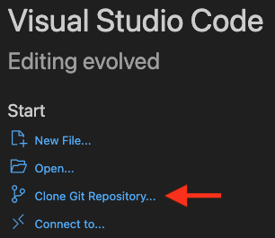
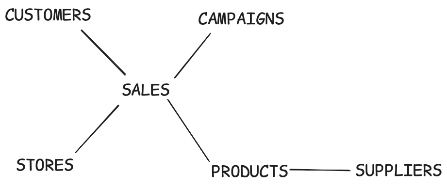
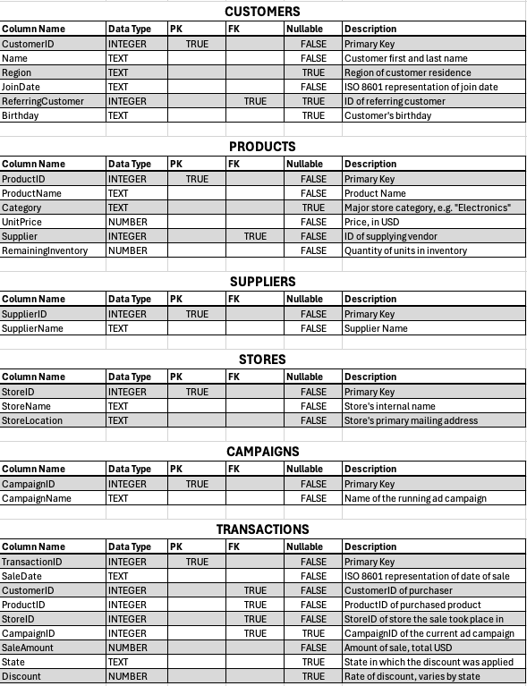
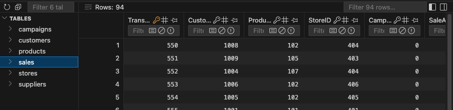
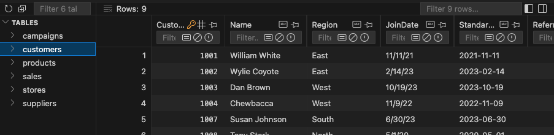
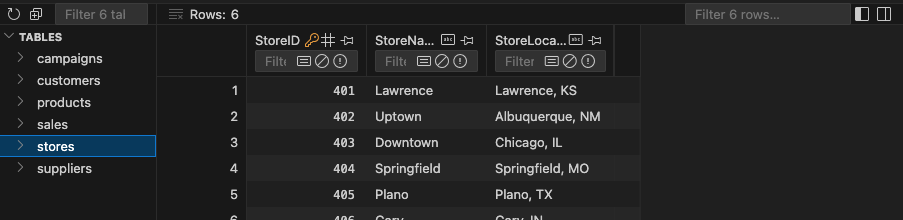
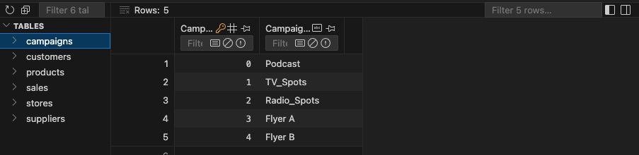
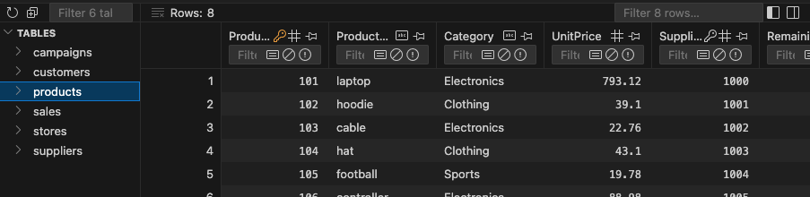
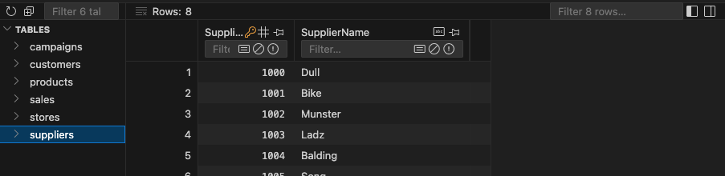

# smart-store-gillespie

- author: Aaron Gillespie  
- date: 2025-03-20
- purpose: NW Missouri University CSIS 44-632 - BI & Analytics

# Setup

## Clone this repo to your machine

In a new VS Code window, click clone git repository:  



Then paste the clone URL:  

`https://github.com/aarongilly/smart-store-gillespie.git`

## Initialize the virtual environment

The following commands establish a virtual python environment, activate it, and install the required packages from `requirements.txt`. This has become boilerplate to every project setup.

```shell
python3 -m venv .venv  
source .venv/bin/activate
python3 -m pip install --upgrade pip  
python3 -m pip install --upgrade -r requirements.txt
```

They can be executed one after the other, or all at once (where they'll be run in series anyway).

## Execute Setup Script

1. Activate the built-in VS Code terminal with shortcut key:  
    
    `ctrl + ~`

2. Verify the terminal utilzes the virtual environment (should say `.venv` somewhere).
3. Run the data prep script with the appropriate command:

    `python3 scripts/data_prep.py` <- Mac / Linux   
        -or-  
    `py scripts\data_prep.py` <- Windows PowerShell

## Testing

This project serves as our introduction to unit testing in Python. The `tests/` folder contains the following tests scripts.

### tests/test_data_scrubber.py

This test script consists of 13 checks which run against an internally-created temporary dataset. The dataset is created with known data quality issues. The `DataScrubber.py` script is invoked on the temporary dataset, creating a scrubbed DataFrame with a known expected output. The tester then flags any deviations between generated output and expected output.

## Database Documentation

The database in this project is designed to log _transactions_ and the necessary dimensions to add meaning to them. The table uses a snowflake schema, although it's small enough to nearly be star schmea.



The schema is as follows:



The following sections display the first few rows & columns of each table.

### SALES


### CUSTOMERS


### STORES


### CAMPAIGNS


### PRODUCTS


### SUPPLIERS
