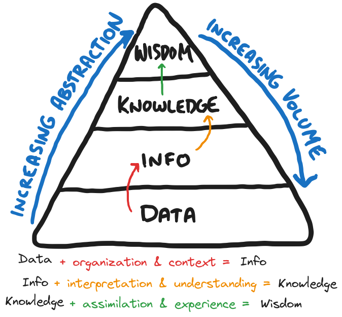

# smart-store-gillespie

- author: Aaron Gillespie  
- date: 2025-03-20
- purpose: NW Missouri University CSIS 44-632 - BI & Analytics

> [!note]
> The **OLAP Assignment Content** is at the bottom of this README.

# Setup

## Clone this repo to your machine

In a new VS Code window, click clone git repository:  


Then paste the clone URL:  

`https://github.com/aarongilly/smart-store-gillespie.git`

## Initialize the virtual environment

The following commands establish a virtual python environment, activate it, and install the required packages from `requirements.txt`. This has become boilerplate to every project setup.

```shell
python3 -m venv .venv  
source .venv/bin/activate
python3 -m pip install --upgrade pip  
python3 -m pip install --upgrade -r requirements.txt
```

They can be executed one after the other, or all at once (where they'll be run in series anyway).

## Execute Setup Script

1. Activate the built-in VS Code terminal with shortcut key:  
    
    `ctrl + ~`

2. Verify the terminal utilzes the virtual environment (should say `.venv` somewhere).
3. Run the data prep script with the appropriate command:

    `python3 scripts/data_prep.py` <- Mac / Linux   
        -or-  
    `py scripts\data_prep.py` <- Windows PowerShell

## Testing

This project serves as our introduction to unit testing in Python. The `tests/` folder contains the following tests scripts.

### tests/test_data_scrubber.py

This test script consists of 13 checks which run against an internally-created temporary dataset. The dataset is created with known data quality issues. The `DataScrubber.py` script is invoked on the temporary dataset, creating a scrubbed DataFrame with a known expected output. The tester then flags any deviations between generated output and expected output.

## Database Documentation

The database in this project is designed to log _transactions_ and the necessary dimensions to add meaning to them. The table uses a snowflake schema, although it's small enough to nearly be star schmea.


The schema is as follows:


### Design Choices
I went into this with the very simple rule - tables should be in 3rd normal form. This means No table contains columns whose value depends on other **non-primary-key** columns. This resulted in the creation ofthe `suppliers` table, turning what would have been a star schema into a light snowflake schema.

> [!warning] Challenges
> Several of my choices early on lead to headaches later

I added new tables that were not part of the minimum viable set. If I'd been satisfied with first normal form (which, for a data warehouse this size, is probably adequate), I could have saved myself a lot of headaches spinning up new tables. 

Even still, the data warehouse doesn't make a _ton_ of sense. I should probably re-title "TransactionID" to "SaleID" to keep the table name matches surrogate primary key theme consistent. The "state" of the Transaction has nothing to do with the store location. I justified this in retrospect by saying "I guess these are online orders, and the customer lives elsewhere" - but that's a stretch. You wouldn't allow this type of weird dependency in a real-world setting. My choice of adding "state" to the SALES data was arbitrary at the time, but left the data warehouse feeling strange.

> [!tldr] Lessons Learned
> - Schema changes are **tedious**
> - Keep it simple sometimes means accept some complexity

## Data Contents
The following sections display the first few rows & columns of each table.

### SALES


### CUSTOMERS


### STORES


### CAMPAIGNS


### PRODUCTS


### SUPPLIERS


# Spark & Juypter

The jupyter notebook `spark_juypter_gillespie.ipynb` works with the generated data warehouse `smart_sales.db` post the `etl_to_dw.py` processing. Its purpose is to demonstrate Spark utilizing our tiny dataset. 

Spark is a fast, distributed processing engine for large-scale data analysis. We used it with a Jupyter Notebook and Python by first configuring a SparkSession with JDBC connection details to your data warehouse. We then used Spark's DataFrame API (via PySpark) within the notebook to query, transform, and analyze tables from the data warehouse, visualizing insights directly in the notebook. This allows interactive exploration of (hypothetically) massive datasets without loading everything into memory.

> [!fail] Getting Spark + JDBC to play nicely on my Mac environment was _TOUGH_

The Juypter notebook is in a "touch it and it falls down" status. Trying to extend beyond the absolute basics of what was assigned caused something that took several hours to get right to break.

The basic idea here is that Spark uses a JDBC connecction to interact with the tables in the Data Warehouse. It is capable of distributing this work horizontally across many machines. It creates a projection of the data which can then be rendered in a Pandas DataFrame for typical slicing & dicing. In this case, however, it was like bringing a shotgun to kill a fly. Technically you can do it, but it's way overpowered for the task at hand - and also much tougher than a more fit-for-purpose tool (e.g. a flyswatter). 

# P6 - BI Insights and Storytelling - OLAP in Practice

> [!note] This heading is for a self-contained assignment building off the previous work.
> Everything below this callout is associated with NW Missouri State University CSIS 44632 assignment P6 - "BI Insights and Storytelling". The context above is still relevant, but this section stands somewhat on its own.

Most data explorations in the real world are done with a **purpose**. There's some goal, some *insight* that's being targeted by the data analyst for the benefit of the customer. These goals range is scope, difficulty, and level of abstraction. 

The role of the data analyist is to work from the base of the [Data-Information-Knowledge-Wisdom Pyramid](https://gillespedia.com/Data%2C+Information%2C+Knowledge%2C+Wisdom+Pyramid), synthesizing data into information, and presenting that information in a way that facilitates knowledge transfer.



It's then up to leadership to have the wisdom to know what to do with it.

## Section 1. The Business Goal

The goals of business are typically pretty simple, in principle - how can we increase profits while reducing risk. In pursuit of these top-level abstract goals things splinter off and get increasingly complex. The business goal of a data analytics project is rarely aimed at **directly** increasing profits and reducing risk - rather it's aimed at some intermediate step assumed to be on the path toward these higher-level abstract goals.

In the case of our hypothetical "Smart Sales" business - you could imagine the following 3 goals:

1. **In which state(s) are most of our online sales take place?**  
Our online customers are located throughout the United States. If we understood which states were contributing the highest volume of sales, we might recognize potential new markets for brick-and-mortar stores.  

2. **Which stores are most dependent on supplier (X)?**  
If a particular supplier were under contract negotiation, what stores may be most impacted by changing of terms in their supplier agreement?  

3. **Which product's sales benefited most from campaign (X)?**  
If we are paying for advertising for a category of products (e.g. health), we'd like to understand which specific products saw a sales bump as a result of the advertising campaign?  

These are the goals I'll use for this analysis as a proxy for what might exist in a real-world setting. Each goal will list considerations for the analysis to-be done. 

## Section 2. Data Source

To answer these questions I will utilize the previously-prepared Data Warehouse (located in this repo at `data/dw/smart_sales.db`). I will NOT be pre-computing anything, nor will we be utilizing Spark or any other tools aimed at tackling big data-type datasets. Our data simply aren't big enough to warrant such tooling. We will, however, be utilizing the **prepared data**, rather than the raw dataset found in the `data/raw` directory. 

Columns used:

| Table | Column |
| ----- | ------ |
| sales | StoreID|
| sales | CampaignID |
| sales | SaleAmount | 
| sales | SaleDate |
| sales | StateCode |
| sales | ProductID |
| products | Supplier |
| products | ProductName |
| suppliers | Supplier Name |
| stores | StoreName |
| campaigns | CampaignName |

## Section 3. Tools

For this work I'll be using a Jupyter Notebook with Python and some key data analysis libraries including Pandas, Seaborn, Matlibplot, and Sqlite. This choice of tooling partly reflects the nature of the challenge to be solved, and partly the environment in which I'm solving them. I am working from my personal Mac Mini, which has no pre-installed tools like PowerBI or Tableau - however no such tooling is required for this analysis. The aformentioned toolset will suffice. At this point I'm quite comfortable working with these tools.

## Section 4. Workflow & Logic

Approaching these on a question-by-question basis:

### 1. **In which state(s) are most of our online sales take place?**  

Here we'll simply look at the state associated with the sales. We'll also consider the date the sale took place in case sales in a given state were high in times past, but have dropped off in recent years. 

*Potential Action:* Establish new frachise locations in state

- Descriptive dimensions: state, year, month
- Numeric metric: total sales amount
- Aggregations: sum
- Slicing: by state
- Dicing: by year

Given the volume of data I'm working with, drilling down to the level of *months* isn't going to produce 

### 2. **Which stores are most dependent on supplier (X)?**  

Here we'll join in the Suppliers into the Sales table. In order to make that join, we must also join in the intermediary table `products` which makes the breadcrumb trail possible. 
 
*Potential Action:* diversify store inventory in support of upcoming supplier negotiations to lower dependency on a given supplier

- Descriptive dimensions: store, supplier, year, month
- Numeric metric: total sales amount
- Aggregations: sum
- Slicing: by supplier
- Dicing: by store and year
- Drilldown: from year to month

### 3. **Which products' sales benefited most from campaign (X)?**  

*Potential Action:* understand advertising response for a particular product to inform future ad spend

- Descriptive dimensions: store, supplier, year, month
- Numeric metric: total sales amount
- Aggregations: sum
- Slicing: by supplier
- Dicing: by store and year
- Drilldown: from year to month

## Results

> [!tip] Charts for these results are included in the Jupyter Notebook. 

### 1. **In which state(s) are most of our online sales take place?**  

Considering every sale in the dataset, the higest revenue states were:

1. Minnesota
2. North Carolina
3. Louisiana
4. Maryland
5. New Mexico

Considering only those states which have trended higher in the most recent year (i.e. since July 2024), the results are slightly different:

1. North Carolina
2. Maryland
3. Deleware
4. Pennsylvania
5. West Virginia

Taking this into account - the online sales are strongest in North Carolina and Maryland both overall and when considering only recent sales. If you were looking to place brick and mortar stores in new states, you might start considering sub-dividing the markets within these states to look for a favorable real-estate in cities in those two states. 

### 2. **Which Stores are most depend on supplier (X)?**

While this was the original question that was asked, the results indicate another factor that cannot be ignored - the supplier named **Dull** makes up the absolute bulk of the sales, almost regardless of which store you consider. If the original business need was to inform coming contract negotiations, you'd immediately need to start preparations for any negotiation including the supplier named **Dull**. Any other supplier is on the chopping block compared to them. 

That said, the original ask was to look at **stores** that depend on any given supplier. While every store depends on **Dull**, there is a store that depends in a disproportionate way (compared to other stores) on a given supplier - the store in Plano, TX is selling more product sourced from **Carhurt** than the other stores. Thus, if negotiations are going poorly with the vendor for off-brand coats, you may need to bolster other product lines in Plano, TX to make up for those **Carhurt Coats** with some genuine brand *Carharts* sourced from the real deal.

Honestly if this were a real-world dataset I'd start suggesting we consider the 80/20 analysis of the overhead we spend working with suppliers *other than* Dull. If we could remove all that overhead and still maintain 90% of our sales, that could very well be a worthwhile trade-off (recognizing this also assumes the risk of being bound to the success of this one supplier). 

### 3. **Which products' sales benefitted most from campaign (X)?**

This is another case of one question going in, but an overwhelming and unexpected result coming out. The sales from **every** campaign were dominated by *laptop* revenue. Given more time for analysis, I'd try to normalize the sales to present a view based on units sold while running one campaign compared to units sold **not** running that campaign. This could isolate the effect of the campaign itself, and compare the sales to the *base rate**. This would make Daniel Kahneman happier, for sure. This is also another case of considering alternative conclusions from the quesiton that was asked. An ethical data analyst would be obliged to ensure that leadership both received the answer to the question that was asked any any other insight that could benefit the company and the stockholders (this assumes rising company value = good ethics, which is an assumption that's always worth more scruitiny than I'll give it here). 

Now, again, the original ask was to do with what products benefited from any given campaign. The one campaign that sicks out in terms of changing the ratio of revenue was `Flyer A`, the bottom-most pie chart. This campaign resulted in a disproportionately high jackets & hats, seemingly. Again given more time I'd check to see whether this is true, or if the campaign actually resulted in a disproportionately *lower* volume of sales of laptops, our cash cow. 

If we had a particularly high profit margin on our apparel, `Flyer A` seems like a promising bit of advertising spend for the future. 